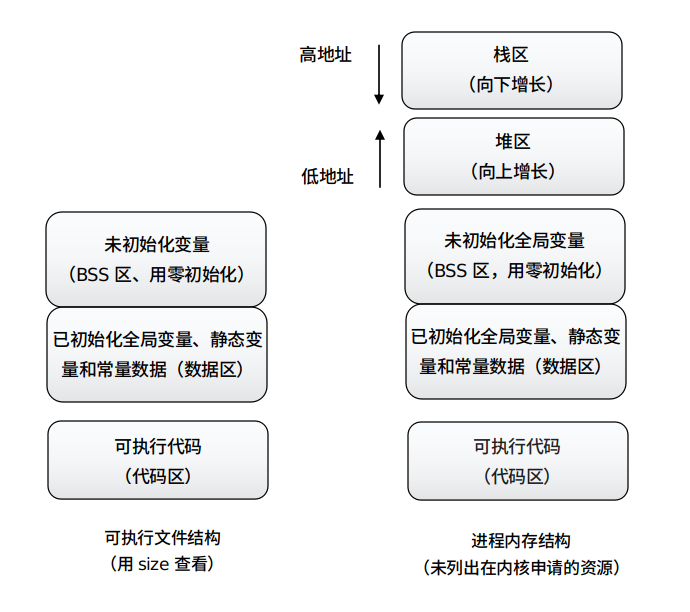

## 「 内存管理 」

<div align="right">
    <a href="https://github.com/fmw666/Linux#-目录导航">返回目录导航 ↩</a>
</div>

+ **[程序存储结构与进程结构](#-程序存储结构与进程结构)**

+ **[C 中变量、函数存储类型](#-c-中变量函数存储类型)**

+ **[常见的内存错误](#-常见的内存错误)**

+ **[内存管理的 C 库函数](#-内存管理的-c-库函数)**

+ **[内存数据管理 C 库函数](#-内存数据管理的-c-库函数)**

### 💬 程序存储结构与进程结构

<div align="center">
    
</div>

> 查看文件基本情况 shell 指令：`$ file 文件名`<br>查看文件存储情况 shell 指令：`$ size 文件名`

<br>

***各段说明***

> 可执行程序包括 [BSS 段](#welcome)、[数据段](#welcome)、[代码段](#welcome)（也称文本段）

+ **代码区（text segment）：** 加载的是可执行文件代码段，其加载到内存中的位置由加载器完成

+ **全局初始化数据区/静态数据区（data segment）：** 加载的是可执行文件数据段，存储于数据段的数据（全局初始化，静态初始化数据），生存周期为整个程序运行过程

+ **未初始化数据区（BSS）：** 加载的是可执行文件 BSS 段，位置可以分开也可以紧靠数据段，存储于数据段的数据（全局未初始化，静态未初始化数据），生存周期为整个程序运行过程

+ **栈区（stack）：** 由编译器自动分配释放，存放函数的参数值、返回值、局部变量等。在程序运行过程中实时加载和释放，因此局部变量的生存周期为申请到释放该段栈空间

+ **堆区（heap）：** 用于动态内存分配。堆在内存中位于 BSS 区和栈区之间，一般由程序员分配和释放，若程序员不释放，程序结束时有可能由操作系统回收

### 💬 C 中变量、函数存储类型

+ 变量声明
  
    ```c
    存储类型 类型修饰符 数据类型 变量名
    
    eg:
    static unsigned int num = 10;
    ```

+ 函数声明

    ```c
    存储类型 返回数据类型 函数名(参数列表)

    eg:
    extern void func(char *str, int num)
    ```

    |类型|作用域|生存域|存储位置|
    |:--|:----|:----|:------|
    |auto 变量|一对 {} 内|当前函数|变量默认存储类型，存储在 栈区|
    |extern 函数|整个程序|整个程序运行期|函数默认存储类型，存储在 代码段|
    |extern 变量|整个程序|整个程序运行期|初始化后存储在 数据段，未初始化在 BSS段|
    |static 函数|当前文件|整个程序运行期|存储在 代码段|
    |static 全局变量|当前文件|整个程序运行期|初始化后存储在 数据段，未初始化在 BSS段|
    |static 局部变量|一对 {} 内|整个程序运行期|初始化后存储在 数据段，未初始化在 BSS段|
    |register 变量|一对 {} 内|当前函数|运行时存储在 CPU 寄存器中|
    |字符串常量|当前文件|整个程序运行期|存储在数据段|

<div align="right">
    <a href="">查看代码中数据存储位置.c ➡</a>
</div>

### 💬 常见的内存错误

&emsp;&emsp;***注意：*** 每项错误会专门有示例演示。

+ **返回局部变量地址错误**

    ```c
    #include <stdio.h>

    int* test(void)
    {
        int i=10;
        return &i;
    }

    int main(void)
    {
        int *p;
        p = test();
        printf("*p=%d\n", *p);
        
        return 0;
    }
    ```

+ **临时空间过大**

    ```c
    int* test(void)
    {
        int a[60][250][1000], i, j, k;
        for(i=0; i<60; i++)
            for(j=0; j<250; j++)
                for(k=0; k<1000; k++)
                    a[i][j][k] = 0;
    }
    ```

+ **空指针**

    ```c
    #include <unistd.h>
    #include <stdlib.h>
    #include <stdio.h>

    int main()
    {
        char *some_memory = (char*)0;
        printf("A read from null %s\n", some_memory);
        sprintf(some_memory, "A write to null\n");
        
        exit(EXIT_SUCCESS);
    }
    ```

+ **滥用**

    ```c
    #include <unistd.h>
    #include <stdlib.h>
    #define ONE_K (1024)

    int main()
    {
        char *some_memory;
        char *scan_ptr;
        
        some_memory = (char*)malloc(ONE_K);
        if(some_memory == NULL)
            exit(EXIT_FAILURE);
        scan_ptr = some_memory;
        while(1)
        {
            *scan_ptr = '\0';
            scan_ptr++;
        }

        exit(EXIT_SUCCESS);
    }
    ```

+ **泄露**

    + 定义：通常指堆内存泄露，即通过 malloc、realloc 和 new 等函数分配内存造成的

    + 错误提示：内存耗尽

    + 出现原因：

        + 堆内存分配后，未释放
        
        + 堆内存分配后，释放顺序不当

    ```c
    #include <unsitd.h>
    #include <stdlib.h>
    #include <stdio.h>
    #define ONE_K (1024)

    int main()
    {
        char *some_memory;
        int size_to_allocate = ONE_K;
        int megs_obtained = 0;
        int ks_obtained = 0;
        
        while(1)
        {
            for(ks_obtained=0; ks_obtained<1024; ks_obtained++)
            {
                some_memory = (char*)malloc(size_to_allocate);
                if(some_memory == NULL)
                    exit(EXIT_FAILURE);
                sprintf(some_memory, "Hello World");
            }
            megs_obtains++;
            printf("Now allocated %d Megabytes\n", megs_obtained);
        }

        exit(EXIT_SUCCESS);
    }
    ```

### 💬 内存管理的 C 库函数

+ **内存分配**

    + 函数原型：
        
        ```c
        void* malloc(size_t size);
        ```
    
    + 头文件：[stdlib.h](#welcome)
    
    + 功能：分配指定长度的内存空间

+ **内存释放**

    + 函数原型：

        ```c
        void free(void *ptr);
        ```

    + 头文件：[stdlib.h](#welcome)
    
    + 功能：释放 ptr 指针所在的内存空间

+ **举例**

    ```c
    #include <stdlib.h>
    #define ONE_K (1024)

    int main()
    {
        char *some_memory;
        int exit_code = EXIT_FAILURE;
        some_memory = (char*)malloc(ONE_K);

        if(some_memory != NULL)
        {
            free(some_memory);
            exit_code = EXIT_SUCCESS;
        }

        exit(exit_code);
    }
    ```

+ **calloc 函数**

    + 函数原型：

        ```c
        void* calloc(size_t num, size_t elesize);
        ```

    + 头文件：[stdlib.h](#welcome)
    
    + 功能：为一个结构数组分配内存

+ **realloc 函数**

    + 函数原型：

        ```c
        void realloc(void *exist, size_t new_size);
        ```

    + 头文件：[stdlib.h](#welcome)
    
    + 功能：为一个已经分配的内存空间改变长度

### 💬 内存数据管理 C 库函数

+ **memcpy 函数**

    + 函数原型：

        ```c
        extern void* memcpy(void *dest, void *src, unsigned n);
        ```

    + 头文件：[string.h](#welcome)
    
    + 功能：将 n 字节从 src 拷贝到 dest 所指向位置

+ **memmove 函数**

    + 函数原型：

        ```c
        extern void* memcpy(void *dest, void *src, size_t count);
        ```

    + 头文件：[string.h](#welcome)
    
    + 功能：由 src 所指内存区域复制 count 个字节到 dest 所指内存区域

+ **memset 函数**

    + 函数原型：

        ```c
        extern void* memset(void *s, int c, size_t n);
        ```

    + 头文件：[string.h](#welcome)
    
    + 功能：将 s 中当前位置后面的n个字节用 c 替换并返回 s

+ **memchr 函数**

    + 函数原型：

        ```c
        extern void* memchr(const void *buf, int c, size_t count);
        ```

    + 头文件：[string.h](#welcome)
    
    + 功能：从 buf 所指内存区域的前 count 个字节查找字符 c。

+ **memcmp 函数**

    + 函数原型：

        ```c
        extern int memcmp(void *s1, void *s2, size_t n);
        ```

    + 头文件：[string.h](#welcome)
    
    + 功能：比较内存区域 s1 和 s2 的前 n 个字节

<div align="center">
    - End -
</div>