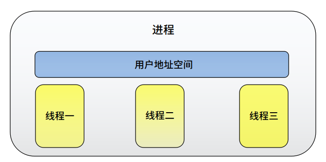

## 「 什么是线程 」

    <a href="https://github.com/fmw666/Linux#-目录导航">返回目录导航 ↩</a>

 

&emsp;&emsp;**线程** 通常叫做轻型级进程，线程是在共享内存空间中并发执行的多道执行路径，它们共享一个进程的资源。

 

+ **创建进程、线程是有区别的。新进程运行时间独立，执行时几乎独立于创建它的进程；而新线程拥有自己的堆栈、代码，但却与创建者共享全局变量等。**
  
+ 

+ **线程的优缺点**

    + 优点：

        + 创建一个新线程的代价要比创建一个新进程小得多。

        + 让一个程序同时做两件事情是很有用的，既提高效率，又降低成本。

    + 缺点：

        + 多线程程序编写中，由于时间偏差，共享了不该共享的变量而造成不良影响的可能性很大。

        + 将运算通过两个线程的程序在一台单处理器上运行不见得很快。

+ **线程分类**

    + **[用户级线程：](#welcome)** 主要解决的是上下文切换的问题，其调度算法和调度过程全部由用户决定

    + **[内核级线程：](#welcome)** 由内核调度机制实现

    + **[两者关系：](#welcome)** 现在大多数操作系统都采用用户级线程和内核级线程并存的方法，用户级线程可与内核级线程实现“一对一”，“一对多”的对应关系

    - End -

