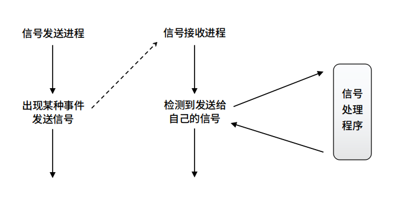
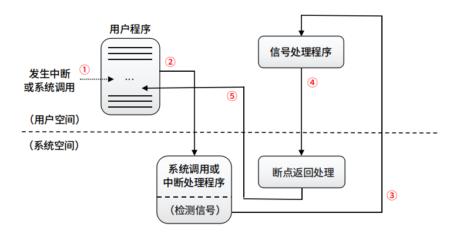

## 「 同主机进程间同步机制——信号（signal） 」

<div align="right">
    <a href="https://github.com/fmw666/Linux#-目录导航">返回目录导航 ↩</a>
</div>

<br>

&emsp;&emsp;**信号（signal，称为软中断）机制** 是在软件层次上对中断机制的一种模拟。

<br>

+ **[信号机制的组成及信号的分类](#-信号机制的组成及信号的分类)**

+ **[进程对信号的处理](#-进程对信号的处理)**

+ **[进程的信号处理函数](#-进程的信号处理函数)**

### 💬 信号机制的组成及信号的分类

+ 信号机制通常包括三部分：

    + 信号的分类、产生和传送

    + 对各种信号预先规定的处理方式

    + 信号的检测和处理

<div align=center>
    
</div>

+ **信号的分类**

    |序号|信号|描述|
    |:-:|:---|:--|
    |1|SIGHUP|远程用户挂断|
    |2|SIGINT|输入中断信号（Ctrl+C）|
    |3|SIGQUIT|输入退出信号（Ctrl+\）|
    |4|SIGILL|非法指令|
    |5|SIGTRAP|遇到调试断电|
    |6|SIGIOT|IOT 指令|
    |7|SIGBUS|总线超时|
    |8|SIGFPE|浮点异常|
    |9|SIGKILL|要求终止进程（不可屏蔽）|
    |10|SIGUSR1|用户自定义|
    |11|SIGSEGV|越界访问内存|
    |12|SIGUSR2|用户自定义|
    |13|SIGPIPE|管道文件只有写进程，没有读进程|
    |14|SIGALRM|定时报警信号|
    |15|SIGTERM|软件终止信号|

### 💬 进程对信号的处理

+ 信号来源

    + 进程彼此间也可用系统提供的系统调用发送信号

    + 普通进程只能向具有相同 uid 和 gid 的进程发送信号或向相同进程组中的其他进程发送信号

+ 处理方式

    + 忽略信号。但不能忽略 SIGKILL 和 SIGSTOP 信号

    + 阻塞信号。进程可以选择对某些信号予以阻塞

    + 由进程处理该信号。用户在 trap 命令中可以指定处理信号的程序，从而进程本身可在系统中标明处理信号的处理程序的地址。当发出该信号时，就由标明的处理程序进行处理

    + 由系统进行默认处理。系统内核对各种信号（除用户自定义之外）都规定了相应的处理程序。在默认情况下，信号就由内核处理，即执行内核预定的处理程序

    <div align="center">
        
    </div>

### 💬 进程的信号处理函数

+ 信号发送

    [kill](#kill) / [raise]() / [alarm]() / [ualarm]()

    + **kill**

        + 功能：向指定进程发送信号

        + 函数声明：

            ```c
            extern int kill(pid_t pid, int sig)
            ```

        + pid：发送信号的进程号

        + sig：发生的信号值

        + 返回值：0 代表成功；-1 代表出错

        + 注意：

            |情况|描述|
            |:-:|:--:|
            |pid>0|将信号发送给进程的 PID 值为 pid 的进程|
            |pid=0|将信号发送给和当前进程在同一进程组的所有进程|
            |pid=-1|将信号发送给系统内的所有进程|
            |pid<0|将信号发送给进程组号 PGID 为 pid 绝对值的所有进程|

    + **raise**

        + 功能：向当前进程发送信号，可以唤醒进程

        + 函数声明：

            ```c
            extern int raise(int sig)
            ```

        + sig：发送的信号值

        + 返回值：0 代表成功；-1 代表出错

    + **alarm**

        + 功能：定时产生一次 SIGALRM 信号

        + 函数声明：

            ```c
            extern unsigned int alarm(unsigned int second)
            ```

        + 返回值：0 代表成功；-1 代表出错

    + **ualarm**

        + 功能：在指定时间开始定时重复产生 SIGALRM 信号

        + 函数声明：

            ```c
            extern usecond ualarm(usecond value, usecond interval)
            ```

        + 举例：[ualarm_exp.c]()

+ 信号安装

    [signal]() / [sigaction]()

    ```c
    struct sigaction {
        union {
            __sighandler_t _sa_handler;     // SIG_DFL、SIG_IGN 信号，类似 signal 函数
            void (*_sa_sigaction)(int, struct siginfo *, void *);       // 信号捕获函数，可以获取其它信息
        }__u;

        sigset_t sa_mask;       // 执行信号捕获函数期间要阻塞的其它信号集
        unsigned long sa_flags;     // 影响信号行为的特殊标志
        void (*sa_restorer)(void);      // 没有使用
    };
    #define sa_handler _u._sa_handler       // 对两成员进行重定义
    #define sa_sigaction _u._sa_sigaction
    ```

    + **signal**

        + 功能：设置一个函数来处理信号，即带有 sig 参数的信号处理程序

        + 函数声明：

            ```c
            typedef void (*__sighandler_t) (int);
            extern __sighandler_t signal(int __sig, __sighandler_t __handler)
            ```

        + __sig：接收到的信号

        + __handler：接收到此信号后的处理函数入口（或下面几个宏：）

            ```c
            /* Fake signal functions */
            #define SIG_ERR ((__sighandler_t) -1)   /* Error return */      // 返回错误
            #define SIG_DFL ((__sighandler_t) 0)    /* Default action */    // 执行信号默认操作
            #define SIG_IGN ((__sighandler_t) 1)    /* Ignore signal */     // 忽略信号
            ```

        + 该函数返回信号处理程序之前的值，当发生错误时返回 SIG_ERR

    + **sigaction**

        + 功能：依参数 __sig 指定的信号编号来设置该信号的处理函数。参数 __sig 可以指定 __act 和 __oact 以外的所有信号

        + 函数声明：

            ```c
            extern int sigaction(int __sig, struct sigaction *__act, struct sigaction *__oact)
            ```

        + __sig：接收到的信号

        + __act：指定欲设置的信号处理信息

        + __oact：返回执行此程序前此信号处理信息

+ 信号屏蔽

    [sigprocmask]()

    + **sigprocmask**

        + 功能：设置进程阻塞的信号集

        + 举例：[sigprocmask_exp.c]()

+ 信号等待

    [pause]() / [sigsuspend]()

    + **pause**

        + 功能：使当前进程处于等待状态，直到当前进程阻塞信号外任意一个信号出现

        + 函数声明：

            ```c
            extern int pause(void)
            ```


    + **sigsuspend**

        + 功能：调用进程阻塞的信号集替换为其参数值，然后挂起该线程，直到传递一个非指定集合中信号为止

        + 函数声明：

            ```c
            extern int sigsuspend(__const sigset_t *__set)
            ```

<div align="center">
    - End -
</div>