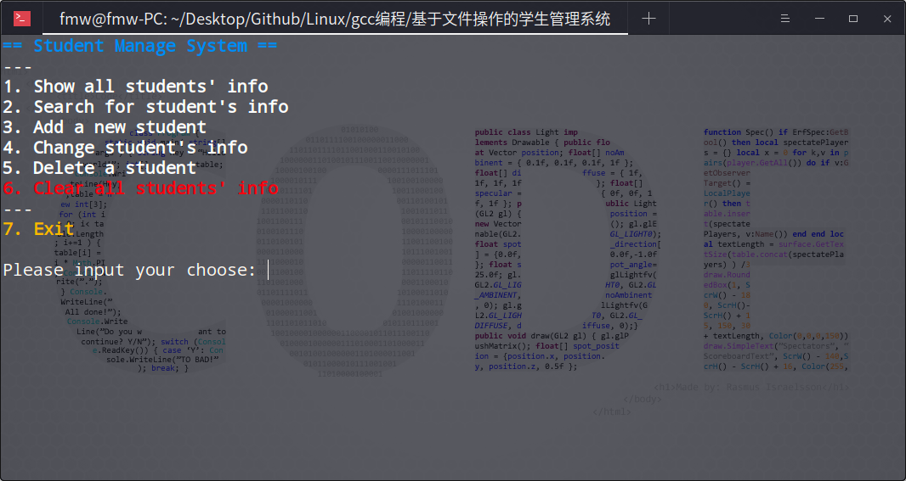

### ✨ 基于文件操作的学生管理系统

<br>
<div align="center">
    
</div>

+ **代码的下载**

    + [点我跳转，查看源代码](https://github.com/fmw666/Linux/blob/master/gcc%E7%BC%96%E7%A8%8B/%E5%9F%BA%E4%BA%8E%E6%96%87%E4%BB%B6%E6%93%8D%E4%BD%9C%E7%9A%84%E5%AD%A6%E7%94%9F%E7%AE%A1%E7%90%86%E7%B3%BB%E7%BB%9F/main.c)

    + [点我直接开始下载源码](https://github.com/fmw666/Linux/raw/master/gcc%E7%BC%96%E7%A8%8B/%E5%9F%BA%E4%BA%8E%E6%96%87%E4%BB%B6%E6%93%8D%E4%BD%9C%E7%9A%84%E5%AD%A6%E7%94%9F%E7%AE%A1%E7%90%86%E7%B3%BB%E7%BB%9F/main.c)

<br>

+ **代码的运行和使用**

    ```bash
    $ gcc main.c -o main && ./main
    ```

<br>

+ **特别说明**

    > 学号最大 12 位，姓名最大 10 位，性别 1 位（0 代表女，1 代表男），电话最大 12 位

<br>

+ **作者联系方式**

    + qq : `784958034`

    + mail : `fmw19990718@qq.com`