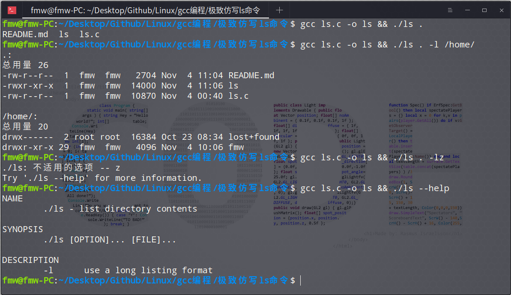

### ✨ 极致仿写 Linux终端下 ls命令

<br>
<div align="center">
    
</div>

+ **代码的下载**

    + [点我跳转，查看源代码](https://github.com/fmw666/Linux/blob/master/gcc%E7%BC%96%E7%A8%8B/%E6%9E%81%E8%87%B4%E4%BB%BF%E5%86%99ls%E5%91%BD%E4%BB%A4/ls.c)

    + [点我直接开始下载源码](https://github.com/fmw666/Linux/raw/master/gcc%E7%BC%96%E7%A8%8B/%E6%9E%81%E8%87%B4%E4%BB%BF%E5%86%99ls%E5%91%BD%E4%BB%A4/ls.c)

<br>

+ **代码的运行和使用**

    ```bash
    $ gcc ls.c -o ls && ./ls
    ls  README.txt  ls.c
    ```

    ```bash
    $ gcc ls.c -o ls && ./ls .
    ls  README.txt  ls.c
    ```

    ```bash
    $ gcc ls.c -o ls && ./ls . -l
    总用量 24
    -rwxr-xr-x  1  fmw  fmw  14000 Nov  4 10:48 ls
    -rw-r--r--  1  fmw  fmw    300 Nov  4 10:48 README.txt
    -rw-r--r--  1  fmw  fmw  10870 Nov  4 00:40 ls.c
    ```

    ```bash
    $ gcc ls.c -o ls && ./ls -l .
    总用量 24
    -rwxr-xr-x  1  fmw  fmw  14000 Nov  4 10:48 ls
    -rw-r--r--  1  fmw  fmw    300 Nov  4 10:48 README.txt
    -rw-r--r--  1  fmw  fmw  10870 Nov  4 00:40 ls.c
    ```

    ```bash
    $ gcc ls.c -o ls && ./ls . -ll /home/
    .:
    总用量 25
    -rwxr-xr-x  1  fmw  fmw  14000 Nov  4 10:49 ls
    -rw-r--r--  1  fmw  fmw    933 Nov  4 10:49 README.txt
    -rw-r--r--  1  fmw  fmw  10870 Nov  4 00:40 ls.c

    /home/:
    总用量 20
    drwx------  2 root root  16384 Oct 23 08:34 lost+found
    drwxr-xr-x 29  fmw  fmw   4096 Nov  4 10:06 fmw
    ```

    ```bash
    $ gcc ls.c -o ls && ./ls . -l /home/ -l
    .:
    总用量 25
    -rwxr-xr-x  1  fmw  fmw  14000 Nov  4 10:49 ls
    -rw-r--r--  1  fmw  fmw    933 Nov  4 10:49 README.txt
    -rw-r--r--  1  fmw  fmw  10870 Nov  4 00:40 ls.c

    /home/:
    总用量 20
    drwx------  2 root root  16384 Oct 23 08:34 lost+found
    drwxr-xr-x 29  fmw  fmw   4096 Nov  4 10:06 fmw
    ```

<br>

+ **仿写的一些错误及提醒（已转为官方翻译的中文）**

    ```bash
    $ gcc ls.c -o ls && ./ls /error
    ./ls: 无法访问'/error': 没有那个文件或目录
    ```

    ```bash
    $ gcc ls.c -o ls && ./ls /home/ -lz
    ./ls: 不适用的选项 -- z
    Try './ls --help' for more information.
    ```

    ```bash
    $ gcc ls.c -o ls && ./ls /home/ -l-l
    ./ls: 不适用的选项 -- -
    Try './ls --help' for more information.
    ```

    ```bash
    $ gcc ls.c -o ls && ./ls /home/ -l.
    ./ls: 不适用的选项 -- .
    Try './ls --help' for more information.
    ```

    ```bash
    $ gcc ls.c -o ls && ./ls --help
    NAME
        ./ls - list directory contents

    SYNOPSIS
        ./ls [OPTION]... [FILE]...

    DESCRIPTION
        -l	use a long listing format
    ```

<br>

+ **特别说明**

    > 当前只添加了 [-l](#welcome) 参数，有兴趣的码友可以在代码中继续添加实现其他参数功能哦～

    > ***[另外：](#welcome)*** 如有代码上逻辑错误，欢迎随时指正。学识有限，经供参考，期待和大家一起交流学习。

<br>

+ **作者联系方式**

    + qq : `784958034`

    + mail : `fmw19990718@qq.com`