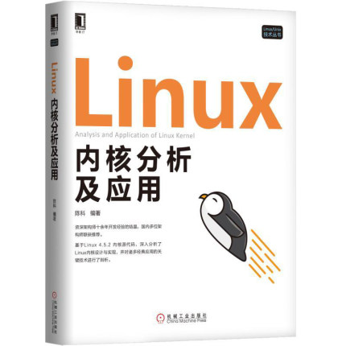

# 「 Linux 内核 」

> **💡 关于 Linux 内核（kernal）这一部分，由于内容较多，而且知识覆盖范围较大，所以希望能带有一定 [计算机操作系统]()、[计算机网络]()、[C 语言]() 等预备知识**

    

&emsp;&emsp;📚 主要参考书籍选自 《Linux 内核分析及应用》 陈科 编著. 机械工业出版社, 2018.

 

## 📝 章节目录

+ ***[进程与线程](#-)***

+ ***[并发](#-)***

+ ***[内容管理]()***

+ ***[中断机制]()***

+ ***[输入输出]()***

+ ***[文件系统]()***

+ ***[Linux 的隔离技术与 Docker 容器]()***

+ ***[Linux 网络层数据流分析]()***
